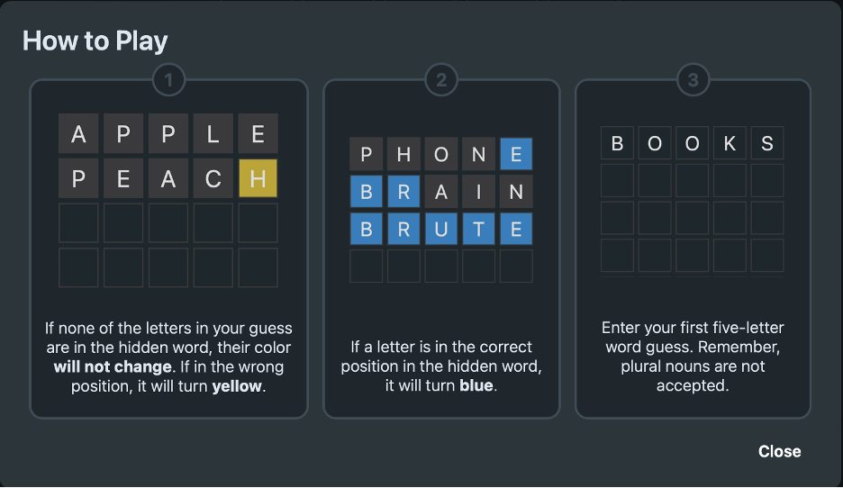

# TileMaster
TileMaster Game created by [Minjae Jang](https://minjae21.github.io/index.html)

## How It's Made:
- **HTML**: The structure of the game is defined using HTML. Key elements include:
  - An input field for entering guesses.
  - A submit button to submit guesses.
  - A display area for the countdown timer.

- **CSS**: The appearance and layout of the game are managed using CSS. Key styles include:
  - Centering Elements: Ensuring the game elements are centered on the page for a neat appearance.
  - Styling Input and Buttons: Making the input field and submit button visually appealing and user-friendly.
  - Feedback Indicators: Highlighting correct letters in blue, correct but misplaced letters in yellow, and incorrect letters with no highlight.

- **JavaScript**: The game logic and interactivity are implemented using JavaScript. Key functions include:
  - Handling User Input: Capturing and processing the player's guesses.
  - Providing Feedback: Comparing the player's guess to the target word and providing visual feedback.
  - Managing the Timer: Implementing a countdown timer, tracking the remaining time, ending the game if time runs out.
  - Win/Loss Conditions: Checking if the player has guessed the correct word or if they have run out of guesses or time, and then displaying the appropriate win or loss message.

## Features
  - Real-time feedback on your guesses.
  - Countdown timer to track the 200-second limit.
  - Visual indicators for correct and misplaced letters.

 ## How to Play:
1. Enter a 5-letter word guess in the input box.
2. You have 9 chances or 200 seconds to guess the correct word.
3. After each guess, the game will automatically provide feedback on the letters in your guess:

   - **Correct letters in the correct position** will be highlighted in blue.
   - **Correct letters in the wrong position** will be highlighted in yellow.
   - **Incorrect letters** will not be highlighted.
